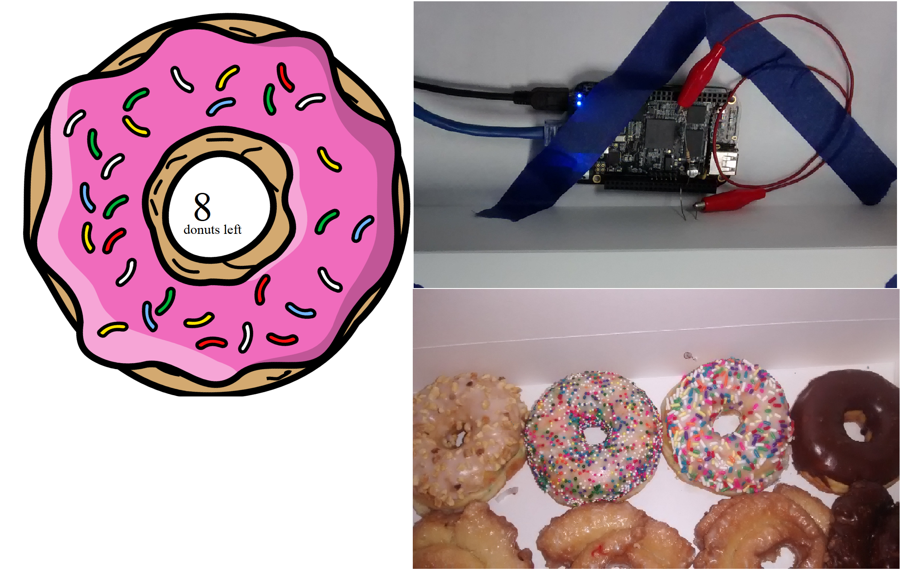
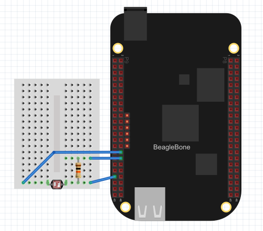

## LabVIEW Donut Counter
Ken Sharp, April 2016 

### **Summary**
This project is an example application for LabVIEW running on a BeagleBone Black.  It reads a photocell sensor located inside a donut box to sense when the box is opened.  Each time the donut box opens and closes a counter is decremented to indicate that a donut has been taken.  The application also uses LabVIEW web services to serve a web page which displays the current donut count.

### **Application Site Map**
* /ws/donut.html - main page
* /ws/GetCount - web service to get current donut count in JSON format
* /ws/SetCount - web service to set count (for instance when donuts are loaded in the box).  Query string should be of the "count=5" to set the counter to 5.

### **Circuit Diagram**

### **License**
This project is licensed under the terms of the MIT license.
